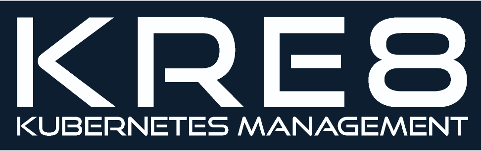

# Build, deploy and monitor a Kubernetes cluster from your desktop

Kre8 is a desktop application that empowers DevOps teams to build, deploy and monitor a Kubernetes cluster in the cloud. The open source version is available to Mac OS users with Amazon Web Services accounts. Users can configure their AWS cluster from their desktop, and then deploy the necessary resources, such as pods, containers, deployments and services. The app features an interactive visualizer with real-time metrics on the status of your pods, services and deployments. The days of assembling metrics from AWS and kubectl to put together reports on your cluster are over! 

## Interactive Kubernetes Visualizer
The interactive visualizer enables developers to view the status of their cluster in realtime. Click on the individual elements within your cluster to get realtime data and metrics.

## Powerful Deployment Dashboard
KRE8's powerful dashboard tool provides the functionality to create and delete deployments within your AWS-hosted Kubernetes cluster.

## Getting started with KRE8

### Prerequisites
  1. MacOS
  2. Kubernetes [kubectl](https://kubernetes.io/docs/tasks/tools/install-kubectl/) Installed
  3. An [Amazon Web Services](https://aws.amazon.com) account and/or have your credentials available
  4. Image(s) of the Application(s) you would like to deploy

### Instructions

*Steps 1 & 2 take AWS approximately 15 minutes to complete. While minimal user input is required, the application needs to remain open for the duration of the process, so please set aside that block of time before beginning.*

#### STEP 1: AWS Elastic Container Service for Kubernetes (EKS) Setup
**- Enter AWS Credentials:** Input your AWS Access Key + Secret Access Key into Kre8’s Welcome Page.
**- AWS Component Creation:** After selecting names for the specified components, Kre8 will communicate with AWS to create the following services: an IAM Role, a Virtual Private Cloud (VPC) Stack, a Cluster and three Worker Nodes

#### STEP 2: Kubernetes Kubectl Configuration
**- Kubectl Configuration:** Kre8 will then configure Kubectl, the official Kubernetes CLI, to communicate with your AWS Cluster

#### STEP 3: Create + Deploy Kubernetes Components
**- Visualization:** At this point, you will be able to visualize and monitor your AWS-hosted components on KRE8.
**- Launch Pods, Services and Deployments:** Enter the specifications for your desired Kubernetes components along with the Docker image of your application to deploy them to the cloud.

### Contributors
[Braden Altstatt](https://github.com/bradenaa) | [Adrian Diamond](https://github.com/AdrianDiamond13) | [Carolyn Harrold](https://github.com/jinihendrix) 
